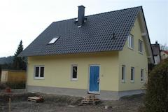
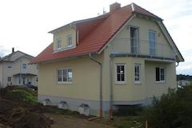
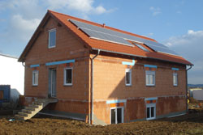
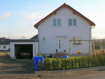

<head>
  <meta charset="utf-8">
  <meta http-equiv="X-UA-Compatible" content="IE=edge">
  <meta name="viewport" content="width=device-width, initial-scale=1">

  <title>{{ page.title | escape }}</title>
  <meta name="description" content="{{ page.excerpt | default: site.description | strip_html | normalize_whitespace | truncate: 160 | escape }}">

  <link rel="stylesheet" type="text/css" href="{{ "/js/slick/slick.css" | relative_url }}" />
  <link rel="stylesheet" type="text/css" href="{{ "/js/slick/slick-theme.css" | relative_url }}" />

  <link rel="stylesheet" href="{{ "/assets/main.css" | relative_url }}">
  <link rel="canonical" href="{{ page.url | replace:'index.html','' | absolute_url }}">

  

  
  

  
  
  
</head>

<body>
  <main class="page-content" aria-label="Content">
    

      <header class="site-header" role="banner">
        
        
        <a class="site-title" href="{{ "/" | relative_url }}">{{ site.title | escape }}</a>

        
          <nav class="site-nav">
            <input type="checkbox" id="nav-trigger" class="nav-trigger" />
            <label for="nav-trigger">
              
                <svg viewBox="0 0 18 15" width="18px" height="15px">
                  <path fill="#424242" d="M18,1.484c0,0.82-0.665,1.484-1.484,1.484H1.484C0.665,2.969,0,2.304,0,1.484l0,0C0,0.665,0.665,0,1.484,0 h15.031C17.335,0,18,0.665,18,1.484L18,1.484z"/>
                  <path fill="#424242" d="M18,7.516C18,8.335,17.335,9,16.516,9H1.484C0.665,9,0,8.335,0,7.516l0,0c0-0.82,0.665-1.484,1.484-1.484 h15.031C17.335,6.031,18,6.696,18,7.516L18,7.516z"/>
                  <path fill="#424242" d="M18,13.516C18,14.335,17.335,15,16.516,15H1.484C0.665,15,0,14.335,0,13.516l0,0 c0-0.82,0.665-1.484,1.484-1.484h15.031C17.335,12.031,18,12.696,18,13.516L18,13.516z"/>
                </svg>
              
            </label>

            

              <a class="page-link" href="#leistungen">Leistungen</a>
              <a class="page-link" href="#referenzen">Referenzen</a>
              <a class="page-link" href="#kontakt">Kontakt</a>
            

          </nav>
        
      </header>

      

        

          
            Wir bauen
          
        

        

          
            Ihr Zuhause
          
        

        

          Tel.: <a href="tel:+491608576884">(0)160 85 76 88 4</a> 
          E-Mail:  
          Baumanagement Mathias Gränitz
        

      

    

    

      

        <h2>Leistungen</h2>

        

          

            Wenn Sie den Neubau eines Ein- oder Zweifamilienhauses in Betracht ziehen, sind Sie hier genau richtig. Ich begleite Sie gern bei der Realisierung Ihres Traumes von den eigenen vier Wänden.
          

           
          

            Profitieren Sie von meinen in über 20 jähriger aktiver Bautätigkeit erworbenen Fähigkeiten. Ich stehe privaten Bauherrn und gewerblichen Auftraggebern gleichermaßen zur Verfügung.
          

           
          

            Besonders wichtig bei der Durchführung Ihrer Baumaßnahme ist Ihre aktive Mitwirkung und Mitgestaltung. Gewöhnlich entstehen die meisten Fragen wenn der Bau einmal läuft.
          

        

      

      

        <h2>Referenzen</h2>

        

          

            

            

            

            

          

        

      

    

  </main>

  <footer class="site-footer">
    

      

        Baumanagement Mathias Gränitz 
        Wittgensdorfer Weg 4 
        09244 Lichtenau 
         
        Tel.: <a href="tel:+491608576884">(0)160 85 76 88 4</a> 
        E-Mail: 
      

    

    
  </footer>
</body>
